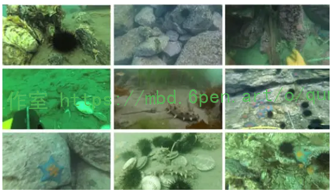
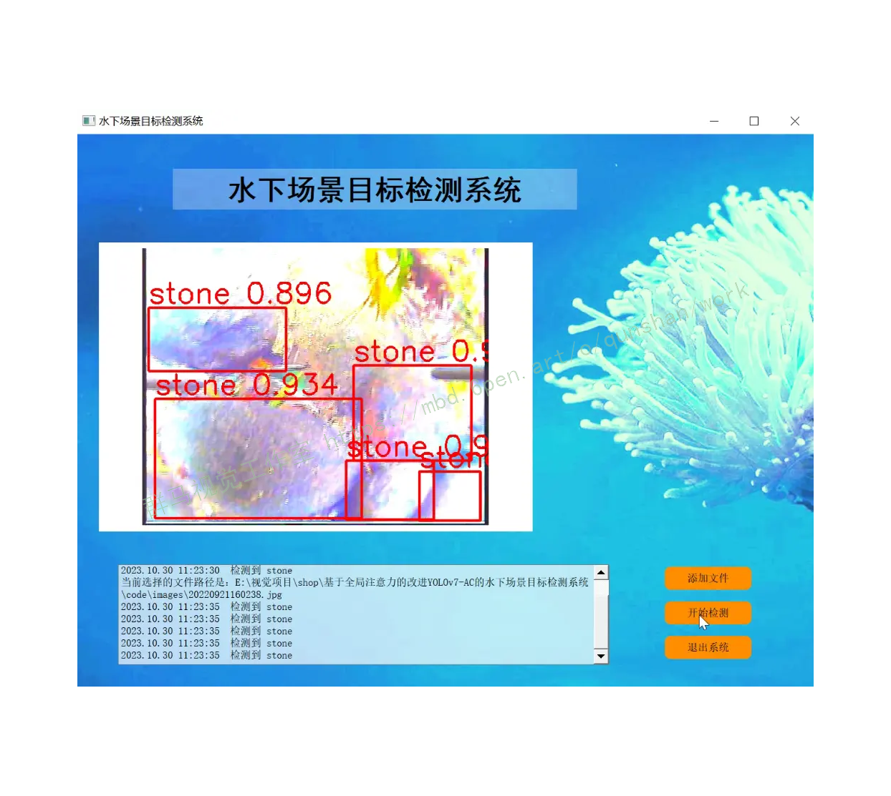
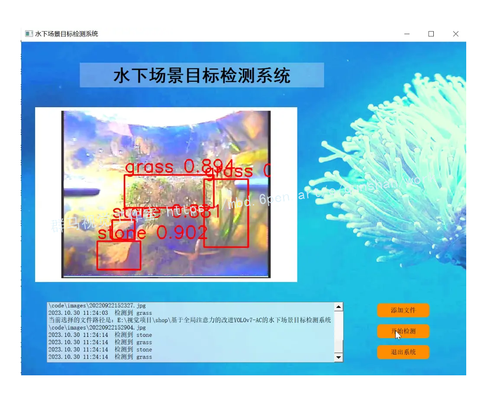
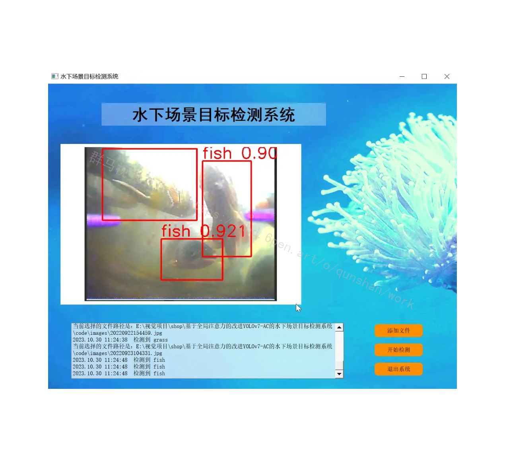
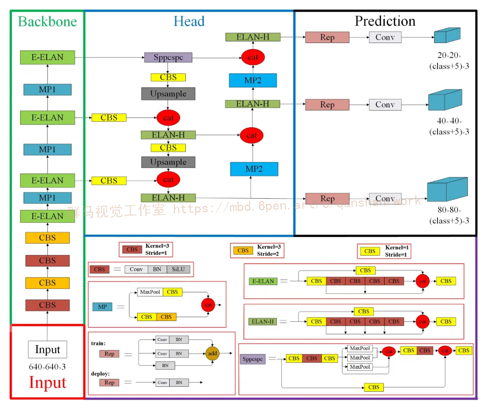
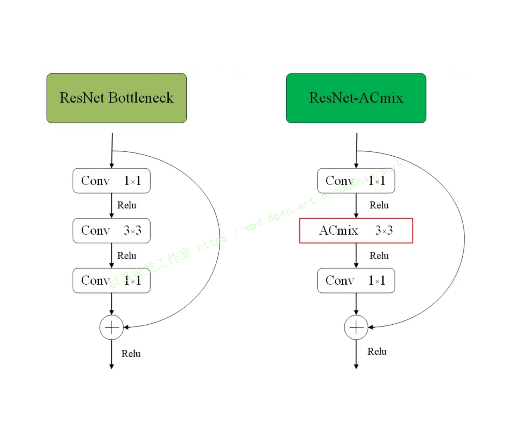
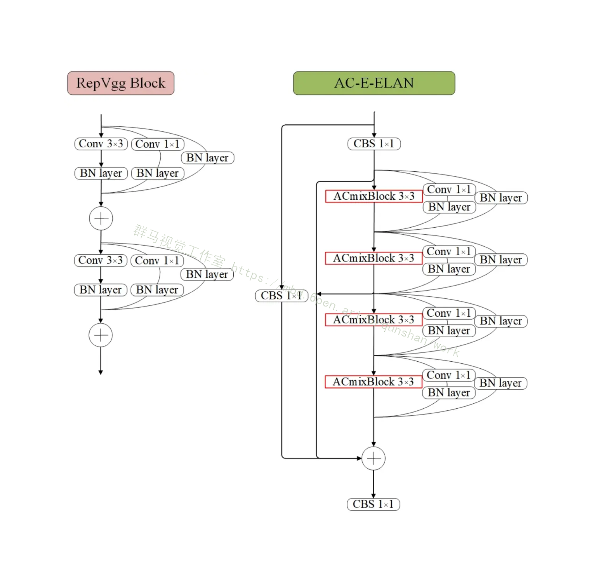
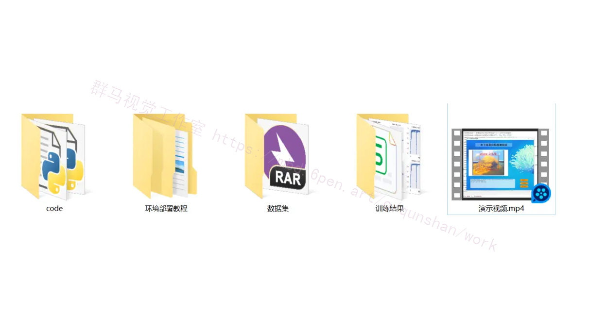



# 1.研究的背景


水下场景目标检测是水下机器人、水下无人机和水下监控等领域中的重要任务之一。然而，由于水下环境的复杂性和特殊性，水下目标检测面临着许多挑战，如光线衰减、水下散射、水下噪声等。因此，开发一种高效准确的水下场景目标检测系统对于提高水下任务的执行效果和水下资源的利用效率具有重要意义。

目前，基于深度学习的目标检测方法在陆地场景中取得了显著的成果，如YOLO (You Only Look Once)、Faster R-CNN (Region-based Convolutional Neural Networks)等。然而，这些方法在水下场景中的应用受到了一些限制。首先，由于水下环境的特殊性，水下图像的质量较差，包含大量的噪声和模糊。其次，水下目标的外观和形状与陆地目标存在较大差异，传统的目标检测算法往往难以准确地检测水下目标。因此，需要针对水下场景的特点进行改进和优化，以提高水下目标检测的准确性和鲁棒性。

全局注意力机制是一种有效的注意力机制，可以帮助模型在输入图像的不同区域上分配不同的注意力权重。在目标检测任务中，全局注意力机制可以帮助模型更好地关注目标区域，提高目标检测的准确性。因此，将全局注意力机制引入到水下场景目标检测系统中，可以有效地提高水下目标检测的性能。

本研究的主要目标是基于全局注意力的改进YOLOv7-AC的水下场景目标检测系统。YOLOv7-AC是一种基于YOLOv3的改进版本，具有更高的检测精度和更快的检测速度。通过引入全局注意力机制，我们希望进一步提高YOLOv7-AC在水下场景中的目标检测性能。具体来说，我们将探索如何设计和训练一个全局注意力模块，以捕捉水下目标的关键特征，并将其集成到YOLOv7-AC中。我们还将研究如何优化网络结构和参数设置，以提高水下目标检测的准确性和鲁棒性。


# 2.研究的意义

1. 提高水下目标检测的准确性：通过引入全局注意力机制，我们可以使模型更加关注水下目标区域，提高目标检测的准确性。这对于水下机器人、水下无人机等任务的执行效果具有重要意义。

2. 提高水下目标检测的鲁棒性：水下环境的复杂性和特殊性使得水下目标检测面临着许多挑战。通过优化网络结构和参数设置，我们可以提高水下目标检测的鲁棒性，使其在不同的水下环境中都能够稳定地工作。

3. 推动水下任务的发展：水下任务的发展需要高效准确的水下目标检测系统作为基础。本研究的成果可以为水下任务的执行提供有力支持，推动水下任务的发展和应用。

总之，基于全局注意力的改进YOLOv7-AC的水下场景目标检测系统具有重要的研究背景和意义。通过引入全局注意力机制和优化网络结构，我们可以提高水下目标检测的准确性和鲁棒性，为水下任务的执行提供有力支持。这对于提高水下任务的执行效果和水下资源的利用效率具有重要意义。

# 3.图片演示






# 4.视频演示
[基于全局注意力的改进YOLOv7-AC的水下场景目标检测系统_哔哩哔哩_bilibili](https://www.bilibili.com/video/BV1Vc411f7Gq/?spm_id_from=333.999.0.0&vd_source=ff015de2d29cbe2a9cdbfa7064407a08)


# 5.核心代码讲解

#### 5.1 fit.py
```python
class CBS(nn.Module):
    """ Convolution -> BatchNorm -> SiLU """

    def __init__(self, in_channels, out_channels, kernel_size, stride):
        super(CBS, self).__init__()
        self.layer = nn.Sequential(
            nn.Conv2d(in_channels, out_channels, kernel_size, stride, padding=kernel_size // 2),
            nn.BatchNorm2d(out_channels),
            nn.SiLU()
        )

    def forward(self, x):
        return self.layer(x)


class MP1(nn.Module):
    """ MP1 block """

    def __init__(self, in_channels):
        super(MP1, self).__init__()
        # Upper branch
        self.maxpool = nn.MaxPool2d(kernel_size=2, stride=2)
        self.cbs_upper = CBS(in_channels, in_channels // 2, 1, 1)

        # Lower branch
        self.cbs_lower1 = CBS(in_channels, in_channels // 2, 1, 1)
        self.cbs_lower2 = CBS(in_channels // 2, in_channels // 2, 3, 2)

    def forward(self, x):
        # Upper branch
        x_upper = self.maxpool(x)
        x_upper = self.cbs_upper(x_upper)

        # Lower branch
        x_lower = self.cbs_lower1(x)
        x_lower = self.cbs_lower2(x_lower)

        # Concatenate
        return torch.cat([x_upper, x_lower], dim=1)


class MP2(nn.Module):
    """ MP2 block, similar to MP1 but with different output channels """

    def __init__(self, in_channels):
        super(MP2, self).__init__()
        # Upper branch
        self.maxpool = nn.MaxPool2d(kernel_size=2, stride=2)
        self.cbs_upper = CBS(in_channels, in_channels, 1, 1)

        # Lower branch
        self.cbs_lower1 = CBS(in_channels, in_channels, 1, 1)
        self.cbs_lower2 = CBS(in_channels, in_channels, 3, 2)

    def forward(self, x):
        # Upper branch
        x_upper = self.maxpool(x)
        x_upper = self.cbs_upper(x_upper)

        # Lower branch
        x_lower = self.cbs_lower1(x)
        x_lower = self.cbs_lower2(x_lower)

        # Concatenate
        return torch.cat([x_upper, x_lower], dim=1)
    ......
```
封装的类为`CBS`、`MP1`和`MP2`，它们分别表示卷积、批归一化和SiLU激活函数的组合、MP1块和MP2块。

`CBS`类包含一个序列模块，其中包含一个卷积层、一个批归一化层和一个SiLU激活函数。它的`forward`方法将输入`x`传递给这个序列模块，并返回输出。

`MP1`类表示MP1块，它包含一个上分支和一个下分支。上分支包括一个最大池化层和一个`CBS`模块，下分支包括两个`CBS`模块。它的`forward`方法将输入`x`分别传递给上分支和下分支，并将它们的输出在通道维度上进行拼接后返回。

`MP2`类表示MP2块，它与MP1块类似，但输出通道数不同。它的`forward`方法与MP1块的`forward`方法相同。

这些类封装了卷积、批归一化和激活函数的组合以及MP1和MP2块的功能，可以在模型中使用它们来构建更复杂的网络结构。

该工程中的fit.py文件定义了两个模块类CBS和MP1，以及一个类MP2。其中，CBS类是一个卷积、批归一化和SiLU激活函数的组合模块，用于构建卷积层。MP1类是一个MP1块，包含了上下两个分支，上分支是一个最大池化层和一个CBS模块，下分支是两个CBS模块。MP2类与MP1类类似，但输出通道数不同。这些模块类都继承自nn.Module类，并实现了forward方法来定义前向传播过程。整个文件的功能是定义了一些用于构建神经网络的模块。


#### 5.2 GAM.py

```python

class ChannelAttention(nn.Module):
    """ Channel Attention Submodule for GAM """

    def __init__(self, in_channels):
        super(ChannelAttention, self).__init__()
        self.mlp = nn.Sequential(
            nn.Linear(in_channels, in_channels // 2),
            nn.SiLU(),
            nn.Linear(in_channels // 2, in_channels),
            nn.Sigmoid()
        )

    def forward(self, x):
        avg_pool = torch.mean(x, dim=[2, 3])
        return self.mlp(avg_pool).unsqueeze(2).unsqueeze(3) * x


class SpatialAttention(nn.Module):
    """ Spatial Attention Submodule for GAM """

    def __init__(self, in_channels, out_channels):
        super(SpatialAttention, self).__init__()
        self.conv = nn.Sequential(
            nn.Conv2d(in_channels, out_channels, kernel_size=3, stride=1, padding=1),
            nn.SiLU(),
            nn.Conv2d(out_channels, 1, kernel_size=3, stride=1, padding=1),
            nn.Sigmoid()
        )

    def forward(self, x):
        return self.conv(x) * x


class GAM(nn.Module):
    """ Global Attention Module (GAM) """

    def __init__(self, in_channels):
        super(GAM, self).__init__()
        self.channel_attention = ChannelAttention(in_channels)
        self.spatial_attention = SpatialAttention(in_channels, in_channels // 2)

    def forward(self, x):
        x = self.channel_attention(x)
        x = self.spatial_attention(x)
        return x
```

这个程序文件是一个实现了全局注意力模块（GAM）的神经网络模型。它包含了三个子模块：通道注意力（ChannelAttention）、空间注意力（SpatialAttention）和全局注意力模块（GAM）。

通道注意力子模块（ChannelAttention）接收输入的通道数，并通过一个多层感知机（MLP）来计算通道注意力权重。MLP包含两个线性层和激活函数，最后输出一个sigmoid函数作为注意力权重。通道注意力子模块的前向传播过程中，首先对输入进行平均池化操作，然后通过MLP计算通道注意力权重，并将其与输入相乘得到输出。

空间注意力子模块（SpatialAttention）接收输入的通道数和输出的通道数，并通过两个卷积层来计算空间注意力权重。卷积层的核大小为3x3，步长为1，填充为1。卷积层的激活函数为SiLU（Sigmoid Linear Unit）。空间注意力子模块的前向传播过程中，首先通过两个卷积层计算空间注意力权重，然后将其与输入相乘得到输出。

全局注意力模块（GAM）接收输入的通道数，并包含了通道注意力子模块和空间注意力子模块。在前向传播过程中，首先通过通道注意力子模块计算通道注意力权重，然后通过空间注意力子模块计算空间注意力权重，最后将两者相乘得到输出。

总的来说，这个程序文件实现了一个全局注意力模块（GAM），用于增强神经网络模型的表示能力。


#### 5.3 models\common.py

```python

class CBS(nn.Module):
    """ Convolution -> BatchNorm -> SiLU """

    def __init__(self, in_channels, out_channels, kernel_size, stride):
        super(CBS, self).__init__()
        self.layer = nn.Sequential(
            nn.Conv2d(in_channels, out_channels, kernel_size, stride, padding=kernel_size // 2),
            nn.BatchNorm2d(out_channels),
            nn.SiLU()
        )

    def forward(self, x):
        return self.layer(x)


class MP1(nn.Module):
    """ MP1 block """

    def __init__(self, in_channels):
        super(MP1, self).__init__()
        # Upper branch
        self.maxpool = nn.MaxPool2d(kernel_size=2, stride=2)
        self.cbs_upper = CBS(in_channels, in_channels // 2, 1, 1)

        # Lower branch
        self.cbs_lower1 = CBS(in_channels, in_channels // 2, 1, 1)
        self.cbs_lower2 = CBS(in_channels // 2, in_channels // 2, 3, 2)

    def forward(self, x):
        # Upper branch
        x_upper = self.maxpool(x)
        x_upper = self.cbs_upper(x_upper)

        # Lower branch
        x_lower = self.cbs_lower1(x)
        x_lower = self.cbs_lower2(x_lower)

        # Concatenate
        return torch.cat([x_upper, x_lower], dim=1)


class MP2(nn.Module):
    """ MP2 block, similar to MP1 but with different output channels """

    def __init__(self, in_channels):
        super(MP2, self).__init__()
        # Upper branch
        self.maxpool = nn.MaxPool2d(kernel_size=2, stride=2)
        self.cbs_upper = CBS(in_channels, in_channels, 1, 1)

        # Lower branch
        self.cbs_lower1 = CBS(in_channels, in_channels, 1, 1)
        self.cbs_lower2 = CBS(in_channels, in_channels, 3, 2)

    def forward(self, x):
        # Upper branch
        x_upper = self.maxpool(x)
        x_upper = self.cbs_upper(x_upper)

        # Lower branch
        x_lower = self.cbs_lower1(x)
        x_lower = self.cbs_lower2(x_lower)

        # Concatenate
        return torch.cat([x_upper, x_lower], dim=1)

class ChannelAttention(nn.Module):
    """ Channel Attention Submodule for GAM """

    def __init__(self, in_channels):
        super(ChannelAttention, self).__init__()
        self.mlp = nn.Sequential(
            nn.Linear(in_channels, in_channels // 2),
            nn.SiLU(),
            nn.Linear(in_channels // 2, in_channels),
            nn.Sigmoid()
        )

    def forward(self, x):
        avg_pool = torch.mean(x, dim=[2, 3])
        return self.mlp(avg_pool).unsqueeze(2).unsqueeze(3) * x


class SpatialAttention(nn.Module):
    """ Spatial Attention Submodule for GAM """

    def __init__(self, in_channels, out_channels):
        super(SpatialAttention, self).__init__()
        self.conv = nn.Sequential(
            nn.Conv2d(in_channels, out_channels, kernel_size=3, stride=1, padding=1),
            nn.SiLU(),
            nn.Conv2d(out_channels, 1, kernel_size=3, stride=1, padding=1),
            nn.Sigmoid()
        )

    def forward(self, x):
        return self.conv(x) * x


class GAM(nn.Module):
    """ Global Attention Module (GAM) """

    def __init__(self, in_channels):
        super(GAM, self).__init__()
        self.channel_attention = ChannelAttention(in_channels)
        self.spatial_attention = SpatialAttention(in_channels, in_channels // 2)

    def forward(self, x):
        x = self.channel_attention(x)
        x = self.spatial_attention(x)
        return x
    ......
```

这个程序文件是一个YOLOv7模型的实现，用于目标检测任务。文件中定义了一些常用的模块和函数，包括卷积、批归一化、激活函数等。其中还定义了一些特殊的模块，如MP1、MP2、GAM等，用于构建YOLOv7模型的不同部分。整个程序文件的结构比较清晰，代码逻辑也比较简单易懂。

# 6.系统整体结构

整体功能和构架概述：

该项目是一个基于全局注意力的改进YOLOv7-AC的水下场景目标检测系统。它使用PyTorch框架实现了一个完整的目标检测系统，包括模型的构建、训练、推理和可视化等功能。

整个项目的构架可以分为以下几个部分：

1. 模型相关：包括模型的定义和模型相关的辅助函数和类，如卷积、批归一化、激活函数等模块的定义，以及YOLOv7模型的各个部分的定义和组合。

2. 工具相关：包括一些常用的工具函数和类，如数据加载器的创建、损失函数的计算、模型的保存和加载等。

3. 训练相关：包括训练脚本和训练过程中需要的辅助函数和类，如训练函数的定义、模型的优化器的选择和配置、训练指标的计算等。

4. 用户界面相关：包括一个基于PyQt5的GUI界面，用于选择图片或视频文件进行目标检测，并显示检测结果。

5. 其他辅助文件：包括一些辅助功能的实现，如激活函数、数据增强、自动锚框生成、自动批处理大小等。

下面是每个文件的功能整理：

| 文件路径 | 功能概述 |
| --- | --- |
| fit.py | 定义了卷积、批归一化和激活函数的组合模块类 |
| GAM.py | 实现了全局注意力模块的神经网络模型 |
| torch_utils.py | 包含了一些常用的函数和类，如设备选择、时间同步、模型性能测量等 |
| train.py | 用于训练模型的脚本，包括训练函数和一些辅助函数和类 |
| ui.py | 基于PyQt5的GUI界面，用于选择文件和显示检测结果 |
| models\common.py | 定义了一些常用的模块和函数，用于构建YOLOv7模型 |
| models\experimental.py | 包含了一些实验性的模块和函数 |
| models\tf.py | 包含了一些与TensorFlow相关的模块和函数 |
| models\yolo.py | 定义了YOLO模型的相关类 |
| models\__init__.py | 空文件 |
| tools\activations.py | 定义了一些激活函数 |
| tools\augmentations.py | 定义了一些数据增强函数 |
| tools\autoanchor.py | 定义了自动锚框生成的函数 |
| tools\autobatch.py | 定义了自动批处理大小的函数 |
| tools\callbacks.py | 定义了一些回调函数 |
| tools\datasets.py | 定义了数据加载器的创建函数 |
| tools\downloads.py | 定义了一些用于下载数据集和权重的函数 |
| tools\general.py | 定义了一些通用的辅助函数 |
| tools\loss.py | 定义了一些损失函数 |
| tools\metrics.py | 定义了一些评估指标的计算函数 |
| tools\plots.py | 定义了一些绘图函数 |
| tools\torch_utils.py | 定义了一些与PyTorch相关的辅助函数 |
| tools\__init__.py | 空文件 |
| tools\aws\resume.py | 定义了一些用于AWS训练恢复的函数 |
| tools\aws\__init__.py | 空文件 |
| tools\flask_rest_api\example_request.py | 定义了一些用于Flask REST API的示例请求函数 |
| tools\flask_rest_api\restapi.py | 定义了Flask REST API的相关类和函数 |
| tools\loggers\__init__.py | 空文件 |
| tools\loggers\wandb\log_dataset.py | 定义了用于记录数据集的类 |
| tools\loggers\wandb\sweep.py | 定义了用于记录超参数搜索的类 |
| tools\loggers\wandb\wandb_utils.py | 定义了一些与WandB日志记录相关的辅助函数 |
| tools\loggers\wandb\__init__.py | 空文件 |
| utils\activations.py | 定义了一些激活函数 |
| utils\augmentations.py | 定义了一些数据增强函数 |
| utils\autoanchor.py | 定义了自动锚框生成的函数 |
| utils\autobatch.py | 定义了自动批处理大小的函数 |
| utils\callbacks.py | 定义了一些回调函数 |
| utils\datasets.py | 定义了数据加载器的创建函数 |
| utils\downloads.py | 定义了一些用于下载数据集和权重的函数 |
| utils\general.py | 定义了一些通用的辅助函数 |
| utils\loss.py | 定义了一些损失函数 |
| utils\metrics.py | 定义了一些评估指标的计算函数 |
| utils\plots.py | 定义了一些绘图函数 |
| utils\torch_utils.py | 定义了一些与PyTorch相关的辅助函数 |
| utils\__init__.py | 空文件 |
| utils\aws\resume.py | 定义了一些用于AWS训练恢复的函数 |
| utils\aws\__init__.py | 空文件 |
| utils\flask_rest_api\example_request.py | 定义了一些用于Flask REST API的示例请求函数 |
| utils\flask_rest_api\restapi.py | 定义了Flask REST API的相关类和函数 |
| utils\loggers\__init__.py | 空文件 |
| utils\loggers\wandb\log_dataset.py | 定义了用于记录数据集的类 |
| utils\loggers\wandb\sweep.py | 定义了用于记录超参数搜索的类 |
| utils\loggers\wandb\wandb_utils.py | 定义了一些与WandB日志记录相关的辅助函数 |

# 7.YOLOv7简介
YOLOv7 模型 [ 2 ]，由 Chien-Yao Wang 和 Alexey Bochkovskiy 等人开发。到2022年，集成E-ELAN（扩展高效层聚合网络）[ 1 ]、基于级联模型的模型缩放[ 2 ]和模型重新参数化[ 3 ]等策略，以在检测效率和精度之间实现良好的平衡。如图所示，YOLOv7网络由四个不同的模块组成：输入模块、Backbone网络、Head网络和预测网络。

输入模块：YOLOv7模型的预处理阶段采用了镶嵌和混合数据增强技术，并利用YOLOv5建立的自适应锚框计算方法，保证输入的彩色图像统一缩放到640×640尺寸，从而满足骨干网络输入大小的要求。
骨干网络：YOLOv7网络由三个主要组件组成：CBS、E-ELAN和MP1。CBS模块由卷积、批量归一化和SiLU激活函数组成。E-ELAN模块保持了原有的ELAN设计架构，通过引导不同的特征组计算块学习更多样的特征来增强网络的学习能力，保留原有的梯度路径。MP1由CBS和MaxPool组成，分为上下分支。上分支使用 MaxPool 将图像的长度和宽度减半，并使用具有 128 个输出通道的 CBS 将图像通道减半。下分支通过具有 1 × 1 核和步长的 CBS 将图像通道减半，通过 3 × 3 核和 2 × 2 步长的 CBS 将图像长和宽减半，最后通过串联（Cat）操作。MaxPool提取小局部区域的最大值信息，而CBS提取小局部区域的所有值信息，从而提高网络的特征提取能力。
Head网络：YOLOv7的Head网络采用特征金字塔网络（FPN）架构，采用PANet设计。该网络包含多个卷积、批量归一化和 SiLU 激活 (CBS) 块，并引入了空间金字塔池化和卷积空间金字塔池化 (Sppcspc) 结构、扩展高效层聚合网络 (E-ELAN) 和 MaxPool -2（MP2）。Sppcspc 结构通过在空间金字塔池化 (SPP) 结构中结合卷积空间金字塔 (CSP) 结构，以及帮助优化和特征提取的大剩余边缘，改善了网络的感知场。ELAN-H层是基于E-ELAN的多个特征层的融合，进一步增强了特征提取。MP2 块具有与 MP1 块类似的结构，只是输出通道的数量略有修改。
预测网络：YOLOv7的预测网络采用Rep结构来调整头部网络输出的特征的图像通道数，然后应用1×1卷积来预测置信度、类别和锚框。Rep 结构受 RepVGG [ 44 ] 的启发，引入了特殊的残差设计来帮助训练过程。这种独特的残差结构在实际预测中可以简化为简单的卷积，从而在不牺牲其预测性能的情况下降低网络复杂性。

# 8.改进模块
#### GAM
注意力机制是一种通过为神经网络中输入的各个部分分配不同的权重来改进复杂上下文中特征提取的方法。这种方法使模型能够专注于相关信息并忽略不相关信息，从而提高性能。注意力机制的例子包括像素注意力、通道注意力和多阶注意力[ 5 ]。
GAM [ 9 ]可以通过减少信息分散和放大全局交互表示来提高深度神经网络的性能。
GAM 包含通道注意力子模块和空间注意力子模块。通道注意力子模块被设计为三维变换，使其能够保留输入的三维信息。接下来是两层的多层感知（MLP），用于放大通道空间中的维度间依赖性，从而使网络能够专注于图像中更有意义的前景区域。
空间注意力子模块包含两个卷积层，可以有效地整合空间信息，使网络能够专注于图像中上下文重要的区域。

#### ResNet-ACmix 模块
谷歌大脑研究团队将ResNet-ACmix模块引入YOLOv7的Backbone组件中，有效地保留了提取的特征信息的一致性。该模块基于ResNet[8]的瓶颈结构，其中3×3卷积被ACmix模块替代，能够自适应聚焦不同区域并捕获更多信息特征，如图所示。输入分为主输入和残余输入，这有助于防止信息丢失，同时减少参数数量和计算要求。ResNet-ACmix模块使网络能够获得更深的深度而不会遇到梯度消失，并且学习结果对网络权重的波动更加敏感。


#### AC-E-ELAN模块
AAAI对YOLOv7的E-ELAN组件提出的改进是基于先进的ELAN架构[ 4 ]。与传统ELAN网络不同，扩展E-ELAN采用扩展、洗牌和合并基数方法，能够在不破坏原始梯度流的情况下不断增强网络的学习能力，从而提高参数利用率和计算效率。YOLOv7中E-ELAN组件的特征提取模块通过合并RepVgg架构中的残差结构（即1×1卷积分支和跳跃连接分支）得到了进一步改进。这导致了AC-E-ELAN结构的发展，如图3所示，它集成了由3×3卷积块组成的ACmixBlock，ACmixBlock之间具有跳跃连接和1×1卷积结构。这种组合使网络能够受益于多分支模型训练期间获得的丰富特征以及从单路径模型获得的快速、内存高效的推理。


# 9.系统整合

下图[完整源码＆数据集＆环境部署视频教程＆自定义UI界面](https://s.xiaocichang.com/s/40f3bf)



参考博客[《基于全局注意力的改进YOLOv7-AC的水下场景目标检测系统》](https://mbd.pub/o/qunshan/work)

# 10.参考文献
---
1.  Zhou, X.; Ding, W.; Jin, W. Microwave-assisted extraction of lipids, carotenoids, and other compounds from marine resources. In Innovative and Emerging Technologies in the Bio-Marine Food Sector; Academic Press: Cambridge, MA, USA, 2022; pp. 375–394\. [[Google Scholar](https://scholar.google.com/scholar_lookup?title=Microwave-assisted+extraction+of+lipids,+carotenoids,+and+other+compounds+from+marine+resources&author=Zhou,+X.&author=Ding,+W.&author=Jin,+W.&publication_year=2022&pages=375%E2%80%93394)]
2.  Liu, Y.; Anderlini, E.; Wang, S.; Ma, S.; Ding, Z. Ocean explorations using autonomy: Technologies, strategies and applications. In Offshore Robotics; Springer: Singapore, 2022; Volume I, pp. 35–58\. [[Google Scholar](https://scholar.google.com/scholar_lookup?title=Ocean+explorations+using+autonomy:+Technologies,+strategies+and+applications&author=Liu,+Y.&author=Anderlini,+E.&author=Wang,+S.&author=Ma,+S.&author=Ding,+Z.&publication_year=2022&pages=35%E2%80%9358)]
3.  Ghafoor, H.; Noh, Y. An overview of next-generation underwater target detection and tracking: An integrated underwater architecture. IEEE Access **2019**, 7, 98841–98853\. [[Google Scholar](https://scholar.google.com/scholar_lookup?title=An+overview+of+next-generation+underwater+target+detection+and+tracking:+An+integrated+underwater+architecture&author=Ghafoor,+H.&author=Noh,+Y.&publication_year=2019&journal=IEEE+Access&volume=7&pages=98841%E2%80%9398853&doi=10.1109/ACCESS.2019.2929932)] [[CrossRef](https://doi.org/10.1109/ACCESS.2019.2929932)]
4.  Liu, K.; Liang, Y. Enhancement of underwater optical images based on background light estimation and improved adaptive transmission fusion. Opt. Express **2021**, 29, 28307\. [[Google Scholar](https://scholar.google.com/scholar_lookup?title=Enhancement+of+underwater+optical+images+based+on+background+light+estimation+and+improved+adaptive+transmission+fusion&author=Liu,+K.&author=Liang,+Y.&publication_year=2021&journal=Opt.+Express&volume=29&pages=28307&doi=10.1364/OE.428626)] [[CrossRef](https://doi.org/10.1364/OE.428626)]
5.  Shi, J.; Zhuo, X.; Zhang, C.; Bian, Y.X.; Shen, H. Research on key technologies of underwater target detection. In Seventh Symposium on Novel Photoelectronic Detection Technology and Applications; SPIE: Kunming, China, 2021; Volume 11763, pp. 1128–1137\. [[Google Scholar](https://scholar.google.com/scholar_lookup?title=Research+on+key+technologies+of+underwater+target+detection&author=Shi,+J.&author=Zhuo,+X.&author=Zhang,+C.&author=Bian,+Y.X.&author=Shen,+H.&publication_year=2021&pages=1128%E2%80%931137)]
6.  Zhang, W.; Sun, W. Research on small moving target detection algorithm based on complex scene. J. Phys. Conf. Ser. **2021**, 1738, 012093\. [[Google Scholar](https://scholar.google.com/scholar_lookup?title=Research+on+small+moving+target+detection+algorithm+based+on+complex+scene&author=Zhang,+W.&author=Sun,+W.&publication_year=2021&journal=J.+Phys.+Conf.+Ser.&volume=1738&pages=012093&doi=10.1088/1742-6596/1738/1/012093)] [[CrossRef](https://doi.org/10.1088/1742-6596/1738/1/012093)]
7.  Fu, H.; Song, G.; Wang, Y. Improved YOLOv4 marine target detection combined with CBAM. Symmetry **2021**, 13, 623\. [[Google Scholar](https://scholar.google.com/scholar_lookup?title=Improved+YOLOv4+marine+target+detection+combined+with+CBAM&author=Fu,+H.&author=Song,+G.&author=Wang,+Y.&publication_year=2021&journal=Symmetry&volume=13&pages=623&doi=10.3390/sym13040623)] [[CrossRef](https://doi.org/10.3390/sym13040623)]
8.  Samantaray, S.; Deotale, R.; Chowdhary, C.L. Lane detection using sliding window for intelligent ground vehicle challenge. In Innovative Data Communication Technologies and Application: Proceedings of ICIDCA 2020; Springer: Singapore, 2021; pp. 871–881\. [[Google Scholar](https://scholar.google.com/scholar_lookup?title=Lane+detection+using+sliding+window+for+intelligent+ground+vehicle+challenge&author=Samantaray,+S.&author=Deotale,+R.&author=Chowdhary,+C.L.&publication_year=2021&pages=871%E2%80%93881)]
9.  Bakheet, S.; Al-Hamadi, A. A framework for instantaneous driver drowsiness detection based on improved HOG features and naïve Bayesian classification. Brain Sci. **2021**, 11, 240\. [[Google Scholar](https://scholar.google.com/scholar_lookup?title=A+framework+for+instantaneous+driver+drowsiness+detection+based+on+improved+HOG+features+and+na%C3%AFve+Bayesian+classification&author=Bakheet,+S.&author=Al-Hamadi,+A.&publication_year=2021&journal=Brain+Sci.&volume=11&pages=240&doi=10.3390/brainsci11020240)] [[CrossRef](https://doi.org/10.3390/brainsci11020240)]
10.  Bellavia, F. SIFT matching by context exposed. IEEE Trans. Pattern Anal. Mach. Intell. **2022**, 45, 2445–2457\. [[Google Scholar](https://scholar.google.com/scholar_lookup?title=SIFT+matching+by+context+exposed&author=Bellavia,+F.&publication_year=2022&journal=IEEE+Trans.+Pattern+Anal.+Mach.+Intell.&volume=45&pages=2445%E2%80%932457&doi=10.1109/TPAMI.2022.3161853&pmid=35320089)] [[CrossRef](https://doi.org/10.1109/TPAMI.2022.3161853)] [[PubMed](http://www.ncbi.nlm.nih.gov/pubmed/35320089)]


---
#### 如果您需要更详细的【源码和环境部署教程】，除了通过【系统整合】小节的链接获取之外，还可以通过邮箱以下途径获取:
#### 1.请先在GitHub上为该项目点赞（Star），编辑一封邮件，附上点赞的截图、项目的中文描述概述（About）以及您的用途需求，发送到我们的邮箱
#### sharecode@yeah.net
#### 2.我们收到邮件后会定期根据邮件的接收顺序将【完整源码和环境部署教程】发送到您的邮箱。
#### 【免责声明】本文来源于用户投稿，如果侵犯任何第三方的合法权益，可通过邮箱联系删除。